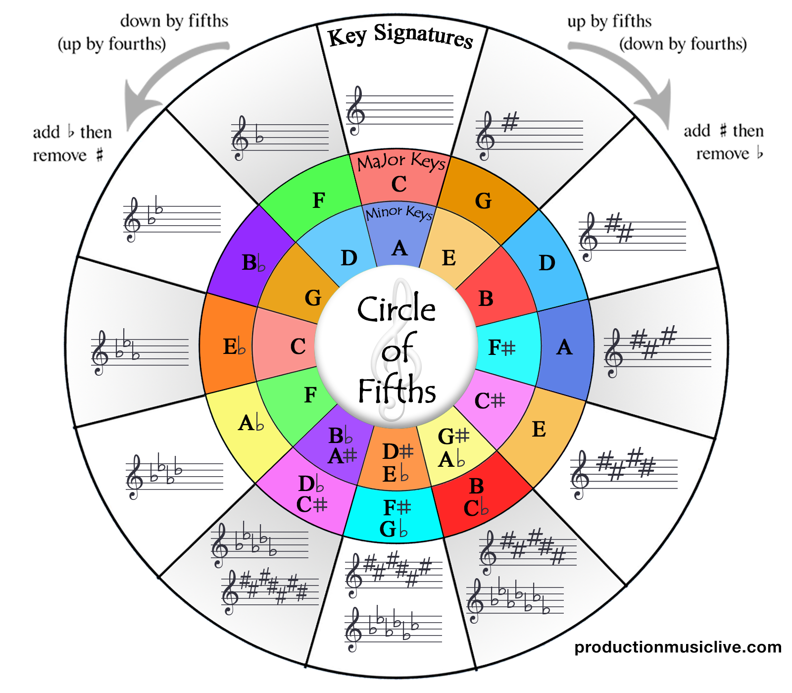

<h1 align="center">Music</h1>

A repository of Music theory & Chord progressions & Beats & Tracks.

 

  

 

#### Map

- [www.musicmap.info](https://www.musicmap.info/)
- [everynoise.com](http://everynoise.com/)

 

#### Genres

- Breakbeats
- Electro
- Fank
- Future bass
  - Kawaii Future Bass
- Hiphop
  - Chill
  - Lo-fi
  - Melodic
- Instrumental
- Jazz
- Pop
- Rap
- Rock
  - Mixture
  - Visual
  - Post
- R&B
- Trap
  - Chill
  - Melodic
- 歌謡

 

#### Tool

- Studio One
- MASCHINE
- MASCHINE STUDIO
- MASCHINE MICRO
- iMASCHINE
- iMPC
- TRAKTOR KONTROL S4
- KOMPLETE KONTROL S49
- KOMPLETE
- Chordbot

 

#### Useful Websites

- [Computer Music Japan](https://computermusic.jp/)
- [NATIVE INSTRUMENTS](https://www.native-instruments.com/jp/)
- [PreSonus](https://www.presonus.com/)
- [Sound Cloud](https://soundcloud.com/discover)

Sound Banks

- [Cymatics](https://cymatics.fm/)
- [Function Loops](https://www.functionloops.com/)
- [99Sounds](http://99sounds.org/)
- [Music Radar](https://www.musicradar.com/)
- [The Drum Broker](https://hiphopdrumsamples.com/)
- [PLUGIN BOUTIQUE](https://www.pluginboutique.com/)
